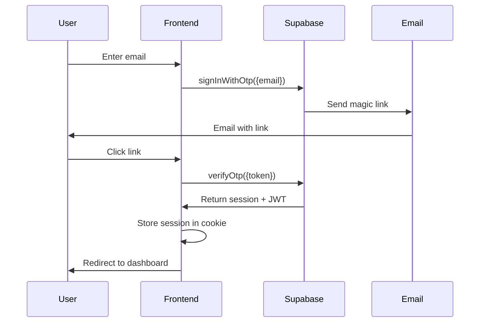

# Christmas Wishlist Application - System Architecture

**Version:** 1.0
**Last Updated:** 2025-01-02
**Status:** Final Design

---

## Table of Contents

1. [Executive Summary](#executive-summary)
2. [System Overview](#system-overview)
3. [Technology Stack](#technology-stack)
4. [System Architecture](#system-architecture)
5. [Database Architecture](#database-architecture)
6. [API Architecture](#api-architecture)
7. [Authentication & Authorization](#authentication--authorization)
8. [Real-time Architecture](#real-time-architecture)
9. [File Storage Architecture](#file-storage-architecture)
10. [Security Architecture](#security-architecture)
11. [Project Structure](#project-structure)
12. [Deployment Architecture](#deployment-architecture)
13. [Scalability & Performance](#scalability--performance)
14. [Development Workflow](#development-workflow)

---

## Executive Summary

### Architecture Decision

**Selected Stack: Supabase + Next.js (Option 2 - Balanced Approach)**

This architecture provides the optimal balance of:
- ✅ Rapid development (2-4 weeks to MVP)
- ✅ SQL database benefits (complex queries, ACID transactions)
- ✅ Built-in real-time capabilities
- ✅ Cost-effective scaling ($0-25/month for 1K users)
- ✅ Open-source (no vendor lock-in)
- ✅ Modern developer experience

### Key Architectural Decisions

| Decision | Choice | Rationale |
|----------|--------|-----------|
| **Database** | PostgreSQL (via Supabase) | Relational data model, ACID compliance, SQL power |
| **Backend** | Supabase (Auto-generated REST + Realtime) | Zero backend maintenance, auto-generated APIs |
| **Frontend** | Next.js 14 (App Router) + TypeScript | React framework, SSR/SSG, excellent DX |
| **Authentication** | Supabase Auth (Magic Links + OAuth) | Built-in, secure, family-friendly |
| **Real-time** | Supabase Realtime (PostgreSQL changes) | Built-in WebSocket subscriptions |
| **Storage** | Supabase Storage (S3-backed) | Integrated, CDN-backed file storage |
| **Deployment** | Vercel (Frontend) + Supabase Cloud (Backend) | Serverless, global CDN, auto-scaling |

---

## System Overview

### Application Purpose

A collaborative Christmas wishlist platform enabling families to:
- Create and manage multiple wishlists per location (e.g., "Mom's House", "Dad's House")
- Share wishlists with family members with granular permissions
- Add items with details (name, price, URL, images)
- Mark items as purchased (hidden from list owner)
- Real-time collaboration (see updates instantly)
- Guest access for viewing shared lists

### Core Features

#### Phase 1: MVP (Weeks 1-4)
- ✅ User authentication (magic links + Google OAuth)
- ✅ Location management (create/edit/delete locations)
- ✅ Wishlist CRUD (create, read, update, delete)
- ✅ Item management (add, edit, remove, mark purchased)
- ✅ Basic sharing (invite via email)
- ✅ Real-time updates (see changes instantly)

#### Phase 2: Enhancement (Weeks 5-8)
- ✅ Image upload for items
- ✅ URL metadata extraction (price, title, image)
- ✅ Advanced sharing (role-based permissions)
- ✅ Activity feed (who added/purchased what)
- ✅ Search and filtering
- ✅ Notifications (email on item purchased)

#### Phase 3: Advanced (Weeks 9-12)
- ✅ Browser extension (one-click add from retailers)
- ✅ Gift recommendations (AI-powered)
- ✅ Budget tracking per list
- ✅ Mobile PWA with offline support
- ✅ Multi-retailer price comparison

### Non-Functional Requirements

| Requirement | Target | Measurement |
|------------|--------|-------------|
| **Performance** | < 200ms API response | p95 latency |
| **Availability** | 99.9% uptime | Monthly average |
| **Scalability** | 10,000 concurrent users | Load testing |
| **Security** | Zero data breaches | Audit compliance |
| **Cost** | < $100/month (1K users) | Monthly billing |

---

## Technology Stack

### Frontend Stack

```yaml
Framework: Next.js 14.0+
  - App Router (React Server Components)
  - TypeScript for type safety
  - Turbopack for fast builds

UI Library: React 18+
  - Server Components + Client Components
  - Suspense for loading states
  - Error boundaries

Styling: Tailwind CSS 3.4+
  - Utility-first CSS
  - shadcn/ui components
  - Dark mode support

State Management:
  - React Query 5.x (server state)
  - Zustand 4.x (client state)
  - React Hook Form (forms)

Real-time: Supabase JS Client 2.x
  - WebSocket subscriptions
  - Presence tracking
  - Optimistic updates

PWA: next-pwa
  - Service worker
  - Offline support
  - App manifest
```

### Backend Stack

```yaml
Platform: Supabase
  - PostgreSQL 15
  - PostgREST (auto-generated REST API)
  - Realtime Server (Phoenix Channels)
  - Edge Functions (Deno)
  - Storage (S3-backed)

Database: PostgreSQL 15
  - Row Level Security (RLS)
  - Database triggers
  - JSONB for flexible data
  - Full-text search

Authentication: Supabase Auth (GoTrue)
  - Magic link authentication
  - OAuth providers (Google, Facebook, Apple)
  - JWT tokens
  - Refresh token rotation

Storage: Supabase Storage
  - S3-backed storage
  - CDN-backed delivery
  - Image transformation
  - Signed URLs
```

### DevOps & Infrastructure

```yaml
Version Control: Git + GitHub
  - Feature branch workflow
  - Pull request reviews
  - GitHub Actions CI/CD

Frontend Hosting: Vercel
  - Global CDN
  - Automatic deployments
  - Preview environments
  - Edge functions

Database Hosting: Supabase Cloud
  - Managed PostgreSQL
  - Automatic backups
  - Point-in-time recovery
  - Connection pooling

Monitoring:
  - Vercel Analytics (frontend)
  - Supabase Dashboard (backend)
  - Sentry (error tracking)
  - Plausible (privacy-friendly analytics)

Email Service: Resend
  - Transactional emails
  - Magic link delivery
  - Purchase notifications
  - Sharing invitations
```

### Development Tools

```yaml
Package Manager: npm 10+
  - Workspaces for monorepo
  - Lock files for reproducibility

TypeScript: 5.3+
  - Strict mode enabled
  - Path aliases configured
  - Type generation from Supabase

Linting/Formatting:
  - ESLint (code quality)
  - Prettier (code formatting)
  - Husky (pre-commit hooks)

Testing:
  - Vitest (unit tests)
  - Playwright (e2e tests)
  - React Testing Library (component tests)
```

---

## System Architecture

### High-Level Architecture Diagram

```
┌─────────────────────────────────────────────────────────────────┐
│                         CLIENT LAYER                             │
├─────────────────────────────────────────────────────────────────┤
│                                                                   │
│  ┌──────────────────┐  ┌──────────────────┐  ┌──────────────┐  │
│  │   Web Browser    │  │   Mobile PWA     │  │   Extension  │  │
│  │   (Desktop)      │  │   (iOS/Android)  │  │   (Chrome)   │  │
│  └────────┬─────────┘  └────────┬─────────┘  └──────┬───────┘  │
│           │                     │                    │           │
│           └─────────────────────┼────────────────────┘           │
│                                 │                                │
└─────────────────────────────────┼────────────────────────────────┘
                                  │
                                  │ HTTPS / WSS
                                  │
┌─────────────────────────────────▼────────────────────────────────┐
│                      PRESENTATION LAYER                           │
├─────────────────────────────────────────────────────────────────┤
│                                                                   │
│  ┌───────────────────────────────────────────────────────────┐  │
│  │              Next.js Application (Vercel)                  │  │
│  │                                                             │  │
│  │  ┌─────────────┐  ┌─────────────┐  ┌─────────────────┐  │  │
│  │  │    Pages    │  │  API Routes │  │  React Server   │  │  │
│  │  │  (App Dir)  │  │  (Backend)  │  │   Components    │  │  │
│  │  └─────────────┘  └─────────────┘  └─────────────────┘  │  │
│  │                                                             │  │
│  │  ┌─────────────────────────────────────────────────────┐  │  │
│  │  │           Supabase JS Client (SDK)                  │  │  │
│  │  │  - REST API calls                                   │  │  │
│  │  │  - Real-time subscriptions                          │  │  │
│  │  │  - Authentication helpers                           │  │  │
│  │  │  - Storage helpers                                  │  │  │
│  │  └─────────────────────────────────────────────────────┘  │  │
│  └───────────────────────────────────────────────────────────┘  │
│                                                                   │
└─────────────────────────────────┬─────────────────────────────────┘
                                  │
                                  │ REST / GraphQL / WebSocket
                                  │
┌─────────────────────────────────▼────────────────────────────────┐
│                      SUPABASE PLATFORM                            │
├─────────────────────────────────────────────────────────────────┤
│                                                                   │
│  ┌──────────────────────────────────────────────────────────┐   │
│  │                  API Gateway Layer                        │   │
│  │  ┌────────────┐  ┌────────────┐  ┌─────────────────┐   │   │
│  │  │  Kong API  │  │    Auth    │  │   Rate Limiter  │   │   │
│  │  │  Gateway   │  │  Middleware│  │                 │   │   │
│  │  └────────────┘  └────────────┘  └─────────────────┘   │   │
│  └──────────────────────────────────────────────────────────┘   │
│                                                                   │
│  ┌──────────────────────────────────────────────────────────┐   │
│  │                  Service Layer                            │   │
│  │                                                             │   │
│  │  ┌────────────────┐  ┌────────────────┐  ┌─────────────┐ │   │
│  │  │   PostgREST    │  │    Realtime    │  │   Storage   │ │   │
│  │  │  (Auto REST)   │  │   (Phoenix)    │  │   (S3)      │ │   │
│  │  │                │  │                │  │             │ │   │
│  │  │  GET /lists    │  │  WebSocket     │  │  Images     │ │   │
│  │  │  POST /items   │  │  Channels      │  │  Avatars    │ │   │
│  │  └───────┬────────┘  └───────┬────────┘  └──────┬──────┘ │   │
│  │          │                   │                   │        │   │
│  └──────────┼───────────────────┼───────────────────┼────────┘   │
│             │                   │                   │            │
│  ┌──────────▼───────────────────▼───────────────────▼────────┐   │
│  │                  GoTrue (Auth Service)                     │   │
│  │  - Magic link authentication                              │   │
│  │  - OAuth integration (Google, Facebook, Apple)            │   │
│  │  - JWT token management                                   │   │
│  │  - Session management                                     │   │
│  └────────────────────────────────────────────────────────────┘   │
│                                                                   │
└─────────────────────────────────┬─────────────────────────────────┘
                                  │
                                  │ SQL / Replication
                                  │
┌─────────────────────────────────▼────────────────────────────────┐
│                        DATA LAYER                                 │
├─────────────────────────────────────────────────────────────────┤
│                                                                   │
│  ┌───────────────────────────────────────────────────────────┐  │
│  │              PostgreSQL 15 (Primary)                       │  │
│  │                                                             │  │
│  │  ┌─────────────┐  ┌─────────────┐  ┌─────────────────┐  │  │
│  │  │   Tables    │  │    Views    │  │    Functions    │  │  │
│  │  │  - users    │  │  - stats    │  │  - triggers     │  │  │
│  │  │  - lists    │  │  - activity │  │  - RLS policies │  │  │
│  │  │  - items    │  │             │  │                 │  │  │
│  │  └─────────────┘  └─────────────┘  └─────────────────┘  │  │
│  │                                                             │  │
│  │  ┌─────────────────────────────────────────────────────┐  │  │
│  │  │              Row Level Security (RLS)               │  │  │
│  │  │  - User can only see their own data                 │  │  │
│  │  │  - Shared lists visible to authorized users         │  │  │
│  │  │  - Purchase status hidden from list owner           │  │  │
│  │  └─────────────────────────────────────────────────────┘  │  │
│  └───────────────────────────────────────────────────────────┘  │
│                                                                   │
│  ┌───────────────────────────────────────────────────────────┐  │
│  │           PostgreSQL (Read Replicas)                       │  │
│  │  - Read-only queries                                       │  │
│  │  - Analytics queries                                       │  │
│  │  - Reporting                                               │  │
│  └───────────────────────────────────────────────────────────┘  │
│                                                                   │
│  ┌───────────────────────────────────────────────────────────┐  │
│  │           Connection Pooler (PgBouncer)                    │  │
│  │  - Pool size: 10-100 connections                           │  │
│  │  - Transaction mode                                        │  │
│  └───────────────────────────────────────────────────────────┘  │
│                                                                   │
└───────────────────────────────────────────────────────────────────┘


┌─────────────────────────────────────────────────────────────────┐
│                    EXTERNAL SERVICES                              │
├─────────────────────────────────────────────────────────────────┤
│                                                                   │
│  ┌──────────────┐  ┌──────────────┐  ┌──────────────────────┐  │
│  │    Resend    │  │   Sentry     │  │   Plausible          │  │
│  │    (Email)   │  │   (Errors)   │  │   (Analytics)        │  │
│  └──────────────┘  └──────────────┘  └──────────────────────┘  │
│                                                                   │
│  ┌──────────────┐  ┌──────────────┐  ┌──────────────────────┐  │
│  │   Rainforest │  │   OpenAI     │  │   Cloudflare         │  │
│  │   API        │  │   (GPT-4)    │  │   (CDN/DDoS)         │  │
│  │   (Parsing)  │  │   (AI Recs)  │  │                      │  │
│  └──────────────┘  └──────────────┘  └──────────────────────┘  │
│                                                                   │
└───────────────────────────────────────────────────────────────────┘
```

### Component Interaction Flow

```typescript
// Example: Adding an item to a wishlist

1. User Input (Frontend)
   ├─> React component captures form data
   └─> Form validation with React Hook Form

2. Optimistic Update (Frontend)
   ├─> Zustand updates local state immediately
   └─> UI shows new item instantly

3. API Call (Frontend → Backend)
   ├─> React Query mutation triggers
   ├─> Supabase client sends POST request
   └─> JWT token included in Authorization header

4. Authentication (Supabase)
   ├─> Kong API Gateway validates JWT
   ├─> GoTrue verifies token signature
   └─> User ID extracted from token

5. Authorization (PostgreSQL)
   ├─> RLS policy checks if user can insert to list
   ├─> Query: "Is user owner or has editor role?"
   └─> If authorized, proceed; else return 403

6. Database Insert (PostgreSQL)
   ├─> INSERT INTO items (...) VALUES (...)
   ├─> Trigger updates list.updated_at
   └─> Returns inserted row with ID

7. Real-time Broadcast (Supabase Realtime)
   ├─> PostgreSQL change captured by replication
   ├─> Phoenix server broadcasts to subscribed clients
   └─> WebSocket sends "INSERT" event to all viewers

8. Update UI (All Connected Clients)
   ├─> WebSocket message received
   ├─> React Query invalidates cache
   ├─> UI updates with new item
   └─> Optimistic update confirmed or rolled back

9. Success Response (Frontend)
   ├─> Toast notification: "Item added!"
   └─> Form resets for next entry
```

---

## Database Architecture

### Entity Relationship Diagram

```
┌──────────────┐
│    users     │
├──────────────┤
│ id (PK)      │◄────┐
│ email        │     │
│ full_name    │     │
│ avatar_url   │     │
│ created_at   │     │
│ updated_at   │     │
└──────────────┘     │
                     │
                     │ (owner)
                     │
┌──────────────┐     │
│  locations   │     │
├──────────────┤     │
│ id (PK)      │     │
│ owner_id (FK)├─────┘
│ name         │
│ description  │
│ created_at   │
│ updated_at   │
└──────┬───────┘
       │
       │ (location)
       │
┌──────▼───────┐
│    lists     │
├──────────────┤
│ id (PK)      │◄────┐
│ owner_id (FK)├───┐ │
│ location_id  │   │ │
│ title        │   │ │
│ description  │   │ │
│ year         │   │ │
│ is_active    │   │ │
│ created_at   │   │ │
│ updated_at   │   │ │
└──────┬───────┘   │ │
       │           │ │
       │ (list)    │ │
       │           │ │
┌──────▼───────┐   │ │
│    items     │   │ │
├──────────────┤   │ │
│ id (PK)      │   │ │
│ list_id (FK) ├───┘ │
│ created_by   ├─────┤
│ title        │     │
│ description  │     │
│ price        │     │
│ currency     │     │
│ url          │     │
│ image_url    │     │
│ is_purchased │     │
│ purchased_by │     │
│ purchased_at │     │
│ priority     │     │
│ created_at   │     │
│ updated_at   │     │
└──────────────┘     │
                     │
                     │
┌──────────────┐     │
│    shares    │     │
├──────────────┤     │
│ id (PK)      │     │
│ resource_type│     │
│ resource_id  │     │
│ shared_by    ├─────┤
│ shared_with  ├─────┘
│ role         │
│ created_at   │
│ expires_at   │
└──────────────┘
```

### PostgreSQL Schema (Complete)

```sql
-- Enable necessary extensions
CREATE EXTENSION IF NOT EXISTS "uuid-ossp";
CREATE EXTENSION IF NOT EXISTS "pg_trgm"; -- For fuzzy search

-- ============================================
-- ENUMS
-- ============================================

CREATE TYPE share_role AS ENUM ('viewer', 'editor', 'admin');
CREATE TYPE priority_level AS ENUM ('low', 'medium', 'high');
CREATE TYPE resource_type AS ENUM ('location', 'list');

-- ============================================
-- USERS TABLE
-- ============================================

CREATE TABLE users (
  id UUID PRIMARY KEY DEFAULT uuid_generate_v4(),
  email TEXT UNIQUE NOT NULL,
  full_name TEXT,
  avatar_url TEXT,
  preferences JSONB DEFAULT '{}',
  created_at TIMESTAMPTZ DEFAULT NOW(),
  updated_at TIMESTAMPTZ DEFAULT NOW()
);

-- Index for email lookups
CREATE INDEX idx_users_email ON users(email);

-- ============================================
-- LOCATIONS TABLE
-- ============================================

CREATE TABLE locations (
  id UUID PRIMARY KEY DEFAULT uuid_generate_v4(),
  owner_id UUID NOT NULL REFERENCES users(id) ON DELETE CASCADE,
  name TEXT NOT NULL,
  description TEXT,
  metadata JSONB DEFAULT '{}',
  created_at TIMESTAMPTZ DEFAULT NOW(),
  updated_at TIMESTAMPTZ DEFAULT NOW()
);

-- Indexes
CREATE INDEX idx_locations_owner_id ON locations(owner_id);
CREATE INDEX idx_locations_created_at ON locations(created_at DESC);

-- ============================================
-- LISTS TABLE
-- ============================================

CREATE TABLE lists (
  id UUID PRIMARY KEY DEFAULT uuid_generate_v4(),
  owner_id UUID NOT NULL REFERENCES users(id) ON DELETE CASCADE,
  location_id UUID REFERENCES locations(id) ON DELETE SET NULL,
  title TEXT NOT NULL,
  description TEXT,
  year INTEGER NOT NULL DEFAULT EXTRACT(YEAR FROM NOW()),
  is_active BOOLEAN DEFAULT TRUE,
  settings JSONB DEFAULT '{"is_public": false, "allow_duplicates": false}',
  created_at TIMESTAMPTZ DEFAULT NOW(),
  updated_at TIMESTAMPTZ DEFAULT NOW()
);

-- Indexes
CREATE INDEX idx_lists_owner_id ON lists(owner_id);
CREATE INDEX idx_lists_location_id ON lists(location_id);
CREATE INDEX idx_lists_year ON lists(year);
CREATE INDEX idx_lists_is_active ON lists(is_active);
CREATE INDEX idx_lists_created_at ON lists(created_at DESC);

-- Full-text search index
CREATE INDEX idx_lists_title_search ON lists USING gin(to_tsvector('english', title));

-- ============================================
-- ITEMS TABLE
-- ============================================

CREATE TABLE items (
  id UUID PRIMARY KEY DEFAULT uuid_generate_v4(),
  list_id UUID NOT NULL REFERENCES lists(id) ON DELETE CASCADE,
  created_by UUID NOT NULL REFERENCES users(id) ON DELETE CASCADE,

  -- Item details
  title TEXT NOT NULL,
  description TEXT,
  url TEXT,
  image_url TEXT,

  -- Pricing
  price DECIMAL(10,2),
  currency TEXT DEFAULT 'USD',

  -- Purchase tracking
  is_purchased BOOLEAN DEFAULT FALSE,
  purchased_by UUID REFERENCES users(id) ON DELETE SET NULL,
  purchased_at TIMESTAMPTZ,

  -- Metadata
  priority priority_level DEFAULT 'medium',
  external_id TEXT, -- ASIN, TCIN, etc.
  metadata JSONB DEFAULT '{}',

  created_at TIMESTAMPTZ DEFAULT NOW(),
  updated_at TIMESTAMPTZ DEFAULT NOW()
);

-- Indexes
CREATE INDEX idx_items_list_id ON items(list_id);
CREATE INDEX idx_items_created_by ON items(created_by);
CREATE INDEX idx_items_is_purchased ON items(is_purchased);
CREATE INDEX idx_items_purchased_by ON items(purchased_by);
CREATE INDEX idx_items_priority ON items(priority);
CREATE INDEX idx_items_created_at ON items(created_at DESC);

-- Full-text search index
CREATE INDEX idx_items_title_search ON items USING gin(to_tsvector('english', title));
CREATE INDEX idx_items_description_search ON items USING gin(to_tsvector('english', description));

-- ============================================
-- SHARES TABLE (Permissions)
-- ============================================

CREATE TABLE shares (
  id UUID PRIMARY KEY DEFAULT uuid_generate_v4(),
  resource_type resource_type NOT NULL,
  resource_id UUID NOT NULL,
  shared_by UUID NOT NULL REFERENCES users(id) ON DELETE CASCADE,
  shared_with UUID NOT NULL REFERENCES users(id) ON DELETE CASCADE,
  role share_role NOT NULL DEFAULT 'viewer',
  created_at TIMESTAMPTZ DEFAULT NOW(),
  expires_at TIMESTAMPTZ,

  -- Prevent duplicate shares
  UNIQUE(resource_type, resource_id, shared_with)
);

-- Indexes
CREATE INDEX idx_shares_resource ON shares(resource_type, resource_id);
CREATE INDEX idx_shares_shared_by ON shares(shared_by);
CREATE INDEX idx_shares_shared_with ON shares(shared_with);
CREATE INDEX idx_shares_expires_at ON shares(expires_at);

-- ============================================
-- ACTIVITY LOG TABLE
-- ============================================

CREATE TABLE activity_log (
  id UUID PRIMARY KEY DEFAULT uuid_generate_v4(),
  user_id UUID REFERENCES users(id) ON DELETE SET NULL,
  action TEXT NOT NULL,
  resource_type TEXT NOT NULL,
  resource_id UUID,
  metadata JSONB DEFAULT '{}',
  created_at TIMESTAMPTZ DEFAULT NOW()
);

-- Indexes
CREATE INDEX idx_activity_log_user_id ON activity_log(user_id);
CREATE INDEX idx_activity_log_resource ON activity_log(resource_type, resource_id);
CREATE INDEX idx_activity_log_created_at ON activity_log(created_at DESC);

-- Partition by month for performance
-- (To be implemented when activity grows)

-- ============================================
-- TRIGGERS
-- ============================================

-- Auto-update updated_at timestamp
CREATE OR REPLACE FUNCTION update_updated_at_column()
RETURNS TRIGGER AS $$
BEGIN
  NEW.updated_at = NOW();
  RETURN NEW;
END;
$$ LANGUAGE plpgsql;

CREATE TRIGGER update_users_updated_at BEFORE UPDATE ON users
  FOR EACH ROW EXECUTE FUNCTION update_updated_at_column();

CREATE TRIGGER update_locations_updated_at BEFORE UPDATE ON locations
  FOR EACH ROW EXECUTE FUNCTION update_updated_at_column();

CREATE TRIGGER update_lists_updated_at BEFORE UPDATE ON lists
  FOR EACH ROW EXECUTE FUNCTION update_updated_at_column();

CREATE TRIGGER update_items_updated_at BEFORE UPDATE ON items
  FOR EACH ROW EXECUTE FUNCTION update_updated_at_column();

-- Log activity on item purchase
CREATE OR REPLACE FUNCTION log_item_purchase()
RETURNS TRIGGER AS $$
BEGIN
  IF NEW.is_purchased = TRUE AND OLD.is_purchased = FALSE THEN
    INSERT INTO activity_log (user_id, action, resource_type, resource_id, metadata)
    VALUES (
      NEW.purchased_by,
      'item_purchased',
      'item',
      NEW.id,
      jsonb_build_object('list_id', NEW.list_id, 'item_title', NEW.title)
    );
  END IF;
  RETURN NEW;
END;
$$ LANGUAGE plpgsql;

CREATE TRIGGER log_item_purchase_trigger AFTER UPDATE ON items
  FOR EACH ROW EXECUTE FUNCTION log_item_purchase();

-- ============================================
-- ROW LEVEL SECURITY (RLS) POLICIES
-- ============================================

-- Enable RLS on all tables
ALTER TABLE users ENABLE ROW LEVEL SECURITY;
ALTER TABLE locations ENABLE ROW LEVEL SECURITY;
ALTER TABLE lists ENABLE ROW LEVEL SECURITY;
ALTER TABLE items ENABLE ROW LEVEL SECURITY;
ALTER TABLE shares ENABLE ROW LEVEL SECURITY;
ALTER TABLE activity_log ENABLE ROW LEVEL SECURITY;

-- USERS: Can read all users, can only update own profile
CREATE POLICY "Users can read all users"
  ON users FOR SELECT
  USING (true);

CREATE POLICY "Users can update own profile"
  ON users FOR UPDATE
  USING (auth.uid() = id);

-- LOCATIONS: Can read own locations + shared locations
CREATE POLICY "Users can read accessible locations"
  ON locations FOR SELECT
  USING (
    owner_id = auth.uid()
    OR id IN (
      SELECT resource_id FROM shares
      WHERE resource_type = 'location'
      AND shared_with = auth.uid()
    )
  );

CREATE POLICY "Users can insert own locations"
  ON locations FOR INSERT
  WITH CHECK (owner_id = auth.uid());

CREATE POLICY "Users can update own locations"
  ON locations FOR UPDATE
  USING (owner_id = auth.uid());

CREATE POLICY "Users can delete own locations"
  ON locations FOR DELETE
  USING (owner_id = auth.uid());

-- LISTS: Can read own lists + shared lists
CREATE POLICY "Users can read accessible lists"
  ON lists FOR SELECT
  USING (
    owner_id = auth.uid()
    OR id IN (
      SELECT resource_id FROM shares
      WHERE resource_type = 'list'
      AND shared_with = auth.uid()
    )
    OR location_id IN (
      SELECT resource_id FROM shares
      WHERE resource_type = 'location'
      AND shared_with = auth.uid()
    )
  );

CREATE POLICY "Users can insert lists to owned/shared locations"
  ON lists FOR INSERT
  WITH CHECK (
    owner_id = auth.uid()
    AND (
      location_id IS NULL
      OR location_id IN (
        SELECT id FROM locations WHERE owner_id = auth.uid()
        UNION
        SELECT resource_id FROM shares
        WHERE resource_type = 'location'
        AND shared_with = auth.uid()
        AND role IN ('editor', 'admin')
      )
    )
  );

CREATE POLICY "Users can update lists with edit permission"
  ON lists FOR UPDATE
  USING (
    owner_id = auth.uid()
    OR id IN (
      SELECT resource_id FROM shares
      WHERE resource_type = 'list'
      AND shared_with = auth.uid()
      AND role IN ('editor', 'admin')
    )
  );

CREATE POLICY "Users can delete own lists"
  ON lists FOR DELETE
  USING (owner_id = auth.uid());

-- ITEMS: Complex policies for purchase hiding
CREATE POLICY "Users can read items in accessible lists"
  ON items FOR SELECT
  USING (
    list_id IN (
      SELECT id FROM lists
      WHERE owner_id = auth.uid()
      OR id IN (
        SELECT resource_id FROM shares
        WHERE resource_type = 'list'
        AND shared_with = auth.uid()
      )
      OR location_id IN (
        SELECT resource_id FROM shares
        WHERE resource_type = 'location'
        AND shared_with = auth.uid()
      )
    )
    -- Hide purchased items from list owner
    AND (
      is_purchased = FALSE
      OR list_id NOT IN (SELECT id FROM lists WHERE owner_id = auth.uid())
      OR purchased_by = auth.uid()
    )
  );

CREATE POLICY "Users can insert items to editable lists"
  ON items FOR INSERT
  WITH CHECK (
    created_by = auth.uid()
    AND list_id IN (
      SELECT id FROM lists WHERE owner_id = auth.uid()
      UNION
      SELECT resource_id FROM shares
      WHERE resource_type = 'list'
      AND shared_with = auth.uid()
      AND role IN ('editor', 'admin')
    )
  );

CREATE POLICY "Users can update items they created or have edit access"
  ON items FOR UPDATE
  USING (
    created_by = auth.uid()
    OR list_id IN (
      SELECT id FROM lists WHERE owner_id = auth.uid()
      UNION
      SELECT resource_id FROM shares
      WHERE resource_type = 'list'
      AND shared_with = auth.uid()
      AND role IN ('editor', 'admin')
    )
  );

CREATE POLICY "Users can delete items they created"
  ON items FOR DELETE
  USING (created_by = auth.uid());

-- SHARES: Can manage shares for resources you own
CREATE POLICY "Users can read shares for accessible resources"
  ON shares FOR SELECT
  USING (
    shared_by = auth.uid()
    OR shared_with = auth.uid()
    OR (
      resource_type = 'location'
      AND resource_id IN (SELECT id FROM locations WHERE owner_id = auth.uid())
    )
    OR (
      resource_type = 'list'
      AND resource_id IN (SELECT id FROM lists WHERE owner_id = auth.uid())
    )
  );

CREATE POLICY "Users can create shares for owned resources"
  ON shares FOR INSERT
  WITH CHECK (
    shared_by = auth.uid()
    AND (
      (resource_type = 'location' AND resource_id IN (SELECT id FROM locations WHERE owner_id = auth.uid()))
      OR (resource_type = 'list' AND resource_id IN (SELECT id FROM lists WHERE owner_id = auth.uid()))
    )
  );

CREATE POLICY "Users can delete shares they created"
  ON shares FOR DELETE
  USING (shared_by = auth.uid());

-- ACTIVITY LOG: Can read activity for accessible resources
CREATE POLICY "Users can read relevant activity"
  ON activity_log FOR SELECT
  USING (
    user_id = auth.uid()
    OR resource_id IN (
      SELECT id FROM lists WHERE owner_id = auth.uid()
      UNION
      SELECT resource_id FROM shares WHERE shared_with = auth.uid()
    )
  );

-- ============================================
-- FUNCTIONS & VIEWS
-- ============================================

-- Get list stats
CREATE OR REPLACE FUNCTION get_list_stats(list_uuid UUID)
RETURNS TABLE (
  total_items BIGINT,
  purchased_items BIGINT,
  total_value NUMERIC,
  purchased_value NUMERIC
) AS $$
BEGIN
  RETURN QUERY
  SELECT
    COUNT(*)::BIGINT AS total_items,
    COUNT(*) FILTER (WHERE is_purchased = TRUE)::BIGINT AS purchased_items,
    COALESCE(SUM(price), 0) AS total_value,
    COALESCE(SUM(price) FILTER (WHERE is_purchased = TRUE), 0) AS purchased_value
  FROM items
  WHERE list_id = list_uuid;
END;
$$ LANGUAGE plpgsql SECURITY DEFINER;

-- Search items across all accessible lists
CREATE OR REPLACE FUNCTION search_items(search_query TEXT)
RETURNS TABLE (
  id UUID,
  list_id UUID,
  title TEXT,
  description TEXT,
  price DECIMAL,
  url TEXT,
  image_url TEXT,
  rank REAL
) AS $$
BEGIN
  RETURN QUERY
  SELECT
    i.id,
    i.list_id,
    i.title,
    i.description,
    i.price,
    i.url,
    i.image_url,
    ts_rank(
      to_tsvector('english', i.title || ' ' || COALESCE(i.description, '')),
      plainto_tsquery('english', search_query)
    ) AS rank
  FROM items i
  WHERE
    to_tsvector('english', i.title || ' ' || COALESCE(i.description, ''))
    @@ plainto_tsquery('english', search_query)
    AND i.list_id IN (
      SELECT id FROM lists
      WHERE owner_id = auth.uid()
      OR id IN (
        SELECT resource_id FROM shares
        WHERE resource_type = 'list'
        AND shared_with = auth.uid()
      )
    )
  ORDER BY rank DESC
  LIMIT 50;
END;
$$ LANGUAGE plpgsql SECURITY DEFINER;

-- ============================================
-- SAMPLE DATA (for development)
-- ============================================

-- Create sample user
INSERT INTO users (id, email, full_name) VALUES
  ('00000000-0000-0000-0000-000000000001', 'test@example.com', 'Test User');

-- Create sample location
INSERT INTO locations (id, owner_id, name, description) VALUES
  ('00000000-0000-0000-0000-000000000002', '00000000-0000-0000-0000-000000000001', 'Mom''s House', 'Christmas at Mom''s');

-- Create sample list
INSERT INTO lists (id, owner_id, location_id, title, description, year) VALUES
  ('00000000-0000-0000-0000-000000000003', '00000000-0000-0000-0000-000000000001', '00000000-0000-0000-0000-000000000002', 'Mom''s 2025 Wishlist', 'Things I want for Christmas', 2025);

-- Create sample items
INSERT INTO items (list_id, created_by, title, description, price, url) VALUES
  ('00000000-0000-0000-0000-000000000003', '00000000-0000-0000-0000-000000000001', 'Kindle Paperwhite', 'E-reader for books', 149.99, 'https://amazon.com/dp/B08N5WRWNW'),
  ('00000000-0000-0000-0000-000000000003', '00000000-0000-0000-0000-000000000001', 'AirPods Pro', 'Noise canceling earbuds', 249.99, 'https://apple.com/airpods-pro');

-- ============================================
-- GRANTS (for service role)
-- ============================================

-- Grant usage on schema
GRANT USAGE ON SCHEMA public TO anon, authenticated;

-- Grant select/insert/update/delete on tables
GRANT SELECT, INSERT, UPDATE, DELETE ON ALL TABLES IN SCHEMA public TO authenticated;
GRANT SELECT ON ALL TABLES IN SCHEMA public TO anon;

-- Grant execute on functions
GRANT EXECUTE ON ALL FUNCTIONS IN SCHEMA public TO authenticated;

-- ============================================
-- SCHEMA VERSION
-- ============================================

CREATE TABLE schema_version (
  version INTEGER PRIMARY KEY,
  applied_at TIMESTAMPTZ DEFAULT NOW()
);

INSERT INTO schema_version (version) VALUES (1);
```

### Data Model Notes

1. **Normalization**: Fully normalized schema (3NF) for data integrity
2. **Foreign Keys**: All relationships enforced with foreign keys
3. **Indexes**: Strategic indexes on frequently queried columns
4. **Full-Text Search**: PostgreSQL tsvector for fast text search
5. **JSONB**: Flexible metadata storage for extensibility
6. **Partitioning**: Activity log table ready for time-based partitioning
7. **RLS Policies**: Database-level authorization (zero trust)
8. **Triggers**: Automatic timestamp updates and activity logging

---

## API Architecture

### REST API Endpoints (Auto-generated by PostgREST)

```yaml
Base URL: https://[project-ref].supabase.co/rest/v1

Authentication:
  - Header: Authorization: Bearer <JWT_TOKEN>
  - Header: apikey: <ANON_KEY>

Content-Type: application/json
```

#### Users

```http
GET    /rest/v1/users?id=eq.{userId}
PATCH  /rest/v1/users?id=eq.{userId}

# Example: Get current user
GET /rest/v1/users?id=eq.{auth.uid()}
```

#### Locations

```http
GET    /rest/v1/locations?select=*,lists(count)
POST   /rest/v1/locations
GET    /rest/v1/locations?id=eq.{locationId}&select=*,lists(*,items(count))
PATCH  /rest/v1/locations?id=eq.{locationId}
DELETE /rest/v1/locations?id=eq.{locationId}

# Example: Get all locations with list counts
GET /rest/v1/locations?select=*,lists(count)&order=created_at.desc

# Example: Get single location with all lists and item counts
GET /rest/v1/locations?id=eq.abc123&select=*,lists(*,items(count))
```

#### Lists

```http
GET    /rest/v1/lists?select=*,location(*),items(*)
POST   /rest/v1/lists
GET    /rest/v1/lists?id=eq.{listId}&select=*,items(*),location(*)
PATCH  /rest/v1/lists?id=eq.{listId}
DELETE /rest/v1/lists?id=eq.{listId}

# Example: Get all active lists for current year
GET /rest/v1/lists?year=eq.2025&is_active=eq.true&order=created_at.desc

# Example: Get single list with all items and location
GET /rest/v1/lists?id=eq.abc123&select=*,items(*),location(*),owner:users(*)

# Example: Get lists by location
GET /rest/v1/lists?location_id=eq.abc123&select=*,items(count)
```

#### Items

```http
GET    /rest/v1/items?list_id=eq.{listId}
POST   /rest/v1/items
GET    /rest/v1/items?id=eq.{itemId}
PATCH  /rest/v1/items?id=eq.{itemId}
DELETE /rest/v1/items?id=eq.{itemId}

# Example: Get all items in a list, sorted by priority
GET /rest/v1/items?list_id=eq.abc123&order=priority.desc,created_at.desc

# Example: Mark item as purchased
PATCH /rest/v1/items?id=eq.abc123
Body: {
  "is_purchased": true,
  "purchased_by": "{userId}",
  "purchased_at": "2025-01-02T10:30:00Z"
}

# Example: Search items by title
GET /rest/v1/items?title=ilike.*Kindle*&select=*,list:lists(title)

# Example: Get unpurchased items
GET /rest/v1/items?list_id=eq.abc123&is_purchased=eq.false
```

#### Shares

```http
GET    /rest/v1/shares?resource_id=eq.{resourceId}
POST   /rest/v1/shares
GET    /rest/v1/shares?id=eq.{shareId}
DELETE /rest/v1/shares?id=eq.{shareId}

# Example: Get all shares for a list
GET /rest/v1/shares?resource_type=eq.list&resource_id=eq.abc123&select=*,shared_with:users(email,full_name)

# Example: Create new share
POST /rest/v1/shares
Body: {
  "resource_type": "list",
  "resource_id": "abc123",
  "shared_by": "{userId}",
  "shared_with": "{targetUserId}",
  "role": "editor"
}

# Example: Check if user has access
GET /rest/v1/shares?resource_id=eq.abc123&shared_with=eq.{userId}
```

#### Activity Log

```http
GET    /rest/v1/activity_log?resource_id=eq.{resourceId}&order=created_at.desc&limit=50

# Example: Get recent activity for a list
GET /rest/v1/activity_log?metadata->>list_id=eq.abc123&order=created_at.desc&limit=20
```

### Real-time Subscriptions

```typescript
// Subscribe to list changes
const subscription = supabase
  .channel('list-changes')
  .on(
    'postgres_changes',
    {
      event: '*',
      schema: 'public',
      table: 'lists',
      filter: `id=eq.${listId}`
    },
    (payload) => {
      console.log('List changed:', payload)
    }
  )
  .subscribe()

// Subscribe to item changes
const itemSubscription = supabase
  .channel('item-changes')
  .on(
    'postgres_changes',
    {
      event: '*',
      schema: 'public',
      table: 'items',
      filter: `list_id=eq.${listId}`
    },
    (payload) => {
      console.log('Item changed:', payload)
      if (payload.eventType === 'INSERT') {
        // Add new item to UI
      } else if (payload.eventType === 'UPDATE') {
        // Update item in UI
      } else if (payload.eventType === 'DELETE') {
        // Remove item from UI
      }
    }
  )
  .subscribe()

// Subscribe to presence (who's viewing)
const presenceChannel = supabase.channel('list-presence')
presenceChannel
  .on('presence', { event: 'sync' }, () => {
    const state = presenceChannel.presenceState()
    console.log('Users viewing:', state)
  })
  .on('presence', { event: 'join' }, ({ key, newPresences }) => {
    console.log('User joined:', newPresences)
  })
  .on('presence', { event: 'leave' }, ({ key, leftPresences }) => {
    console.log('User left:', leftPresences)
  })
  .subscribe(async (status) => {
    if (status === 'SUBSCRIBED') {
      await presenceChannel.track({
        user_id: userId,
        online_at: new Date().toISOString()
      })
    }
  })
```

### Edge Functions (Deno)

```typescript
// supabase/functions/extract-metadata/index.ts
// Extract product metadata from URL

import { serve } from 'https://deno.land/std@0.168.0/http/server.ts'
import { createClient } from 'https://esm.sh/@supabase/supabase-js@2'

serve(async (req) => {
  const { url } = await req.json()

  // Extract metadata using OpenGraph or Rainforest API
  const metadata = await extractMetadata(url)

  return new Response(
    JSON.stringify(metadata),
    { headers: { 'Content-Type': 'application/json' } }
  )
})

// supabase/functions/send-purchase-notification/index.ts
// Notify list owner when item is purchased

import { serve } from 'https://deno.land/std@0.168.0/http/server.ts'
import { Resend } from 'https://esm.sh/resend@1.0.0'

serve(async (req) => {
  const { itemId, purchasedBy } = await req.json()

  // Send email notification
  const resend = new Resend(Deno.env.get('RESEND_API_KEY'))

  await resend.emails.send({
    from: 'wishlist@example.com',
    to: ownerEmail,
    subject: 'Someone purchased an item from your wishlist!',
    html: `<p>Good news! An item was just purchased from your wishlist.</p>`
  })

  return new Response('OK')
})
```

---

## Authentication & Authorization

### Authentication Flow (Magic Links)



### Authentication Implementation

```typescript
// lib/supabase.ts
import { createClientComponentClient } from '@supabase/auth-helpers-nextjs'

export const supabase = createClientComponentClient()

// Sign in with magic link
export async function signInWithMagicLink(email: string) {
  const { data, error } = await supabase.auth.signInWithOtp({
    email,
    options: {
      emailRedirectTo: `${window.location.origin}/auth/callback`
    }
  })

  if (error) throw error
  return data
}

// Sign in with Google
export async function signInWithGoogle() {
  const { data, error } = await supabase.auth.signInWithOAuth({
    provider: 'google',
    options: {
      redirectTo: `${window.location.origin}/auth/callback`,
      queryParams: {
        access_type: 'offline',
        prompt: 'consent'
      }
    }
  })

  if (error) throw error
  return data
}

// Get current session
export async function getSession() {
  const { data: { session }, error } = await supabase.auth.getSession()
  if (error) throw error
  return session
}

// Sign out
export async function signOut() {
  const { error } = await supabase.auth.signOut()
  if (error) throw error
}

// Listen for auth changes
export function onAuthStateChange(callback: (session: Session | null) => void) {
  return supabase.auth.onAuthStateChange((_event, session) => {
    callback(session)
  })
}
```

### Authorization (RLS Policies)

Authorization is handled at the database level using Row Level Security (RLS) policies. See [Database Architecture](#database-architecture) section for complete RLS policy definitions.

**Key authorization rules:**
1. Users can only read/write their own data
2. Shared resources are accessible based on share permissions (viewer/editor/admin)
3. Purchased items are hidden from list owners
4. Only resource owners can create shares
5. Activity logs respect resource access permissions

---

## Real-time Architecture

### Real-time Features

1. **Live Item Updates**: See new items added instantly
2. **Purchase Notifications**: Know when someone claims an item
3. **Presence Indicators**: See who's viewing the list
4. **Optimistic UI**: Instant feedback, sync in background
5. **Conflict Resolution**: Last-write-wins for most fields

### Real-time Implementation

```typescript
// hooks/useListItems.ts
import { useEffect, useState } from 'react'
import { supabase } from '@/lib/supabase'
import { useQuery, useMutation, useQueryClient } from '@tanstack/react-query'

export function useListItems(listId: string) {
  const queryClient = useQueryClient()

  // Fetch items
  const { data: items, isLoading } = useQuery({
    queryKey: ['items', listId],
    queryFn: async () => {
      const { data, error } = await supabase
        .from('items')
        .select('*')
        .eq('list_id', listId)
        .order('created_at', { ascending: false })

      if (error) throw error
      return data
    }
  })

  // Subscribe to real-time changes
  useEffect(() => {
    const channel = supabase
      .channel(`items:${listId}`)
      .on(
        'postgres_changes',
        {
          event: '*',
          schema: 'public',
          table: 'items',
          filter: `list_id=eq.${listId}`
        },
        (payload) => {
          console.log('Real-time update:', payload)

          // Invalidate cache to refetch
          queryClient.invalidateQueries({ queryKey: ['items', listId] })
        }
      )
      .subscribe()

    return () => {
      supabase.removeChannel(channel)
    }
  }, [listId, queryClient])

  // Add item mutation with optimistic update
  const addItemMutation = useMutation({
    mutationFn: async (newItem: Omit<Item, 'id' | 'created_at' | 'updated_at'>) => {
      const { data, error } = await supabase
        .from('items')
        .insert(newItem)
        .select()
        .single()

      if (error) throw error
      return data
    },
    onMutate: async (newItem) => {
      // Cancel outgoing refetches
      await queryClient.cancelQueries({ queryKey: ['items', listId] })

      // Snapshot previous value
      const previousItems = queryClient.getQueryData(['items', listId])

      // Optimistically update cache
      queryClient.setQueryData(['items', listId], (old: Item[]) => [
        { ...newItem, id: 'temp-' + Date.now(), created_at: new Date().toISOString() },
        ...old
      ])

      return { previousItems }
    },
    onError: (_err, _newItem, context) => {
      // Rollback on error
      queryClient.setQueryData(['items', listId], context?.previousItems)
    },
    onSettled: () => {
      // Refetch after mutation
      queryClient.invalidateQueries({ queryKey: ['items', listId] })
    }
  })

  return {
    items,
    isLoading,
    addItem: addItemMutation.mutate
  }
}
```

### Presence Tracking

```typescript
// hooks/usePresence.ts
import { useEffect, useState } from 'react'
import { supabase } from '@/lib/supabase'

interface PresenceState {
  user_id: string
  online_at: string
}

export function usePresence(listId: string, userId: string) {
  const [presences, setPresences] = useState<Record<string, PresenceState>>({})

  useEffect(() => {
    const channel = supabase.channel(`presence:list:${listId}`)

    channel
      .on('presence', { event: 'sync' }, () => {
        const state = channel.presenceState<PresenceState>()
        setPresences(state)
      })
      .on('presence', { event: 'join' }, ({ key, newPresences }) => {
        console.log('User joined:', key, newPresences)
      })
      .on('presence', { event: 'leave' }, ({ key, leftPresences }) => {
        console.log('User left:', key, leftPresences)
      })
      .subscribe(async (status) => {
        if (status === 'SUBSCRIBED') {
          await channel.track({
            user_id: userId,
            online_at: new Date().toISOString()
          })
        }
      })

    return () => {
      channel.untrack()
      supabase.removeChannel(channel)
    }
  }, [listId, userId])

  return {
    presences,
    count: Object.keys(presences).length
  }
}
```

---

## File Storage Architecture

### Storage Buckets

```yaml
Buckets:
  avatars:
    public: true
    max_size: 2MB
    allowed_mime_types:
      - image/jpeg
      - image/png
      - image/webp
    transformations: true

  item-images:
    public: true
    max_size: 5MB
    allowed_mime_types:
      - image/jpeg
      - image/png
      - image/webp
      - image/gif
    transformations: true
```

### Storage Security Policies

```sql
-- Avatars: Users can upload their own avatar
CREATE POLICY "Users can upload own avatar"
  ON storage.objects FOR INSERT
  WITH CHECK (
    bucket_id = 'avatars'
    AND auth.uid()::text = (storage.foldername(name))[1]
  );

CREATE POLICY "Anyone can view avatars"
  ON storage.objects FOR SELECT
  USING (bucket_id = 'avatars');

-- Item images: Users can upload to lists they have access to
CREATE POLICY "Users can upload item images to accessible lists"
  ON storage.objects FOR INSERT
  WITH CHECK (
    bucket_id = 'item-images'
    AND (storage.foldername(name))[1] IN (
      SELECT id::text FROM lists WHERE owner_id = auth.uid()
      UNION
      SELECT resource_id::text FROM shares
      WHERE resource_type = 'list'
      AND shared_with = auth.uid()
      AND role IN ('editor', 'admin')
    )
  );

CREATE POLICY "Anyone can view item images"
  ON storage.objects FOR SELECT
  USING (bucket_id = 'item-images');
```

### File Upload Implementation

```typescript
// lib/storage.ts
import { supabase } from './supabase'

export async function uploadAvatar(userId: string, file: File) {
  const fileExt = file.name.split('.').pop()
  const fileName = `${userId}/avatar.${fileExt}`

  const { data, error } = await supabase.storage
    .from('avatars')
    .upload(fileName, file, {
      cacheControl: '3600',
      upsert: true
    })

  if (error) throw error

  // Get public URL
  const { data: { publicUrl } } = supabase.storage
    .from('avatars')
    .getPublicUrl(fileName)

  return publicUrl
}

export async function uploadItemImage(listId: string, itemId: string, file: File) {
  const fileExt = file.name.split('.').pop()
  const fileName = `${listId}/${itemId}.${fileExt}`

  const { data, error } = await supabase.storage
    .from('item-images')
    .upload(fileName, file, {
      cacheControl: '3600',
      upsert: true
    })

  if (error) throw error

  // Get public URL with transformation
  const { data: { publicUrl } } = supabase.storage
    .from('item-images')
    .getPublicUrl(fileName, {
      transform: {
        width: 400,
        height: 400,
        resize: 'cover',
        format: 'webp'
      }
    })

  return publicUrl
}
```

---

## Security Architecture

### Security Layers

```
┌────────────────────────────────────────────────────────────┐
│ Layer 1: Network Security                                  │
│ - Cloudflare DDoS protection                               │
│ - Rate limiting (100 req/min per IP)                       │
│ - HTTPS only (TLS 1.3)                                     │
└────────────────────────────────────────────────────────────┘
                          ↓
┌────────────────────────────────────────────────────────────┐
│ Layer 2: API Gateway (Kong)                                │
│ - API key validation                                       │
│ - JWT verification                                         │
│ - Request validation                                       │
└────────────────────────────────────────────────────────────┘
                          ↓
┌────────────────────────────────────────────────────────────┐
│ Layer 3: Application Security                              │
│ - Input sanitization                                       │
│ - SQL injection prevention (parameterized queries)         │
│ - XSS protection (Content Security Policy)                 │
│ - CSRF protection (SameSite cookies)                       │
└────────────────────────────────────────────────────────────┘
                          ↓
┌────────────────────────────────────────────────────────────┐
│ Layer 4: Database Security (RLS)                           │
│ - Row Level Security policies                              │
│ - User can only access authorized data                     │
│ - No direct database access from client                    │
└────────────────────────────────────────────────────────────┘
```

### Content Security Policy

```typescript
// middleware.ts
import { NextResponse } from 'next/server'

export function middleware(request: Request) {
  const response = NextResponse.next()

  // Content Security Policy
  response.headers.set(
    'Content-Security-Policy',
    `
      default-src 'self';
      script-src 'self' 'unsafe-eval' 'unsafe-inline' https://vercel.live;
      style-src 'self' 'unsafe-inline';
      img-src 'self' data: https://*.supabase.co;
      font-src 'self';
      connect-src 'self' https://*.supabase.co wss://*.supabase.co;
      frame-ancestors 'none';
    `.replace(/\s+/g, ' ').trim()
  )

  // Additional security headers
  response.headers.set('X-Frame-Options', 'DENY')
  response.headers.set('X-Content-Type-Options', 'nosniff')
  response.headers.set('Referrer-Policy', 'strict-origin-when-cross-origin')
  response.headers.set('Permissions-Policy', 'camera=(), microphone=(), geolocation=()')

  return response
}
```

### Rate Limiting

```typescript
// lib/rate-limit.ts
import { Ratelimit } from '@upstash/ratelimit'
import { Redis } from '@upstash/redis'

const redis = new Redis({
  url: process.env.UPSTASH_REDIS_REST_URL!,
  token: process.env.UPSTASH_REDIS_REST_TOKEN!
})

// Create rate limiter: 10 requests per 10 seconds
export const ratelimit = new Ratelimit({
  redis,
  limiter: Ratelimit.slidingWindow(10, '10 s'),
  analytics: true
})

// Usage in API route
export async function POST(request: Request) {
  const ip = request.headers.get('x-forwarded-for') ?? 'unknown'
  const { success } = await ratelimit.limit(ip)

  if (!success) {
    return new Response('Too many requests', { status: 429 })
  }

  // Process request
}
```

### Data Encryption

```yaml
At Rest:
  - Database: AES-256 encryption (Supabase managed)
  - Storage: AES-256 encryption (S3 server-side)
  - Backups: AES-256 encryption

In Transit:
  - HTTPS: TLS 1.3
  - WebSocket: WSS (TLS 1.3)
  - Internal: mTLS (between services)

Application Level:
  - Passwords: bcrypt (if we had passwords, but we use magic links)
  - Tokens: JWT with RS256 signing
  - API keys: Environment variables only, never in code
```

---

## Project Structure

```
xmasList/
├── .github/
│   └── workflows/
│       ├── ci.yml                 # GitHub Actions CI
│       └── deploy.yml             # Deployment workflow
│
├── app/                           # Next.js App Router
│   ├── (auth)/                    # Auth routes
│   │   ├── login/
│   │   └── callback/
│   │
│   ├── (dashboard)/               # Protected routes
│   │   ├── dashboard/
│   │   ├── lists/
│   │   │   ├── [id]/
│   │   │   └── new/
│   │   ├── locations/
│   │   └── settings/
│   │
│   ├── share/                     # Public sharing routes
│   │   └── [token]/
│   │
│   ├── api/                       # API routes
│   │   ├── auth/
│   │   ├── lists/
│   │   ├── items/
│   │   └── shares/
│   │
│   ├── layout.tsx                 # Root layout
│   ├── page.tsx                   # Landing page
│   └── globals.css                # Global styles
│
├── components/                    # React components
│   ├── ui/                        # shadcn/ui components
│   │   ├── button.tsx
│   │   ├── input.tsx
│   │   ├── dialog.tsx
│   │   └── ...
│   │
│   ├── lists/                     # List components
│   │   ├── list-card.tsx
│   │   ├── list-form.tsx
│   │   └── list-filters.tsx
│   │
│   ├── items/                     # Item components
│   │   ├── item-card.tsx
│   │   ├── item-form.tsx
│   │   ├── item-purchase-button.tsx
│   │   └── item-grid.tsx
│   │
│   ├── locations/                 # Location components
│   │   ├── location-card.tsx
│   │   └── location-selector.tsx
│   │
│   ├── sharing/                   # Sharing components
│   │   ├── share-dialog.tsx
│   │   ├── share-link.tsx
│   │   └── permissions-select.tsx
│   │
│   ├── layout/                    # Layout components
│   │   ├── header.tsx
│   │   ├── sidebar.tsx
│   │   └── footer.tsx
│   │
│   └── common/                    # Common components
│       ├── loading-spinner.tsx
│       ├── error-boundary.tsx
│       └── toast.tsx
│
├── lib/                           # Utility libraries
│   ├── supabase.ts                # Supabase client
│   ├── auth.ts                    # Auth helpers
│   ├── storage.ts                 # Storage helpers
│   ├── utils.ts                   # General utilities
│   └── constants.ts               # Constants
│
├── hooks/                         # Custom React hooks
│   ├── use-auth.ts
│   ├── use-list.ts
│   ├── use-items.ts
│   ├── use-presence.ts
│   └── use-realtime.ts
│
├── store/                         # State management (Zustand)
│   ├── auth-store.ts
│   ├── ui-store.ts
│   └── list-store.ts
│
├── types/                         # TypeScript types
│   ├── database.ts                # Generated from Supabase
│   ├── api.ts
│   └── models.ts
│
├── supabase/                      # Supabase files
│   ├── migrations/                # Database migrations
│   │   └── 20250102000000_initial_schema.sql
│   │
│   ├── functions/                 # Edge functions
│   │   ├── extract-metadata/
│   │   └── send-notification/
│   │
│   └── config.toml                # Supabase config
│
├── public/                        # Static assets
│   ├── images/
│   ├── icons/
│   └── manifest.json              # PWA manifest
│
├── tests/                         # Tests
│   ├── unit/
│   ├── integration/
│   └── e2e/
│
├── docs/                          # Documentation
│   ├── ARCHITECTURE.md            # This file
│   ├── API.md
│   └── DEPLOYMENT.md
│
├── .env.example                   # Environment variables template
├── .env.local                     # Local environment variables (gitignored)
├── next.config.js                 # Next.js configuration
├── tailwind.config.ts             # Tailwind configuration
├── tsconfig.json                  # TypeScript configuration
├── package.json                   # Dependencies
└── README.md                      # Project README
```

---

## Deployment Architecture

### Infrastructure Diagram

```
┌─────────────────────────────────────────────────────────────┐
│                         USERS                                │
└────────────────────────┬────────────────────────────────────┘
                         │
                         │ HTTPS
                         │
┌────────────────────────▼────────────────────────────────────┐
│                   Cloudflare CDN                             │
│  - DDoS protection                                           │
│  - SSL/TLS termination                                       │
│  - Static asset caching                                      │
│  - Rate limiting                                             │
└────────────────────────┬────────────────────────────────────┘
                         │
         ┌───────────────┴───────────────┐
         │                               │
         │ HTML/JS/CSS                   │ API/WebSocket
         │                               │
┌────────▼─────────┐           ┌────────▼──────────┐
│  Vercel Edge     │           │   Supabase Cloud  │
│  (Global CDN)    │           │   (us-east-1)     │
│                  │           │                   │
│  - Next.js app   │           │  - PostgreSQL     │
│  - Edge functions│           │  - Auth (GoTrue)  │
│  - ISR/SSG pages │           │  - Storage (S3)   │
│                  │           │  - Realtime       │
└──────────────────┘           └───────────────────┘
```

### Deployment Environments

```yaml
Development:
  Frontend: localhost:3000
  Backend: Supabase local (Docker)
  Database: PostgreSQL local
  Auth: Supabase local

Staging:
  Frontend: staging.wishlist.app (Vercel Preview)
  Backend: staging-project.supabase.co
  Database: PostgreSQL (Supabase staging)
  Auth: Supabase Auth staging

Production:
  Frontend: wishlist.app (Vercel)
  Backend: prod-project.supabase.co
  Database: PostgreSQL (Supabase prod)
  Auth: Supabase Auth production
  CDN: Cloudflare
```

### CI/CD Pipeline

```yaml
# .github/workflows/ci.yml
name: CI/CD Pipeline

on:
  push:
    branches: [main, develop]
  pull_request:
    branches: [main, develop]

jobs:
  lint:
    runs-on: ubuntu-latest
    steps:
      - uses: actions/checkout@v3
      - uses: actions/setup-node@v3
        with:
          node-version: 18
      - run: npm ci
      - run: npm run lint
      - run: npm run typecheck

  test:
    runs-on: ubuntu-latest
    steps:
      - uses: actions/checkout@v3
      - uses: actions/setup-node@v3
      - run: npm ci
      - run: npm run test
      - run: npm run test:e2e

  deploy-preview:
    if: github.event_name == 'pull_request'
    needs: [lint, test]
    runs-on: ubuntu-latest
    steps:
      - uses: actions/checkout@v3
      - uses: amondnet/vercel-action@v20
        with:
          vercel-token: ${{ secrets.VERCEL_TOKEN }}
          vercel-org-id: ${{ secrets.VERCEL_ORG_ID }}
          vercel-project-id: ${{ secrets.VERCEL_PROJECT_ID }}

  deploy-production:
    if: github.ref == 'refs/heads/main'
    needs: [lint, test]
    runs-on: ubuntu-latest
    steps:
      - uses: actions/checkout@v3
      - uses: amondnet/vercel-action@v20
        with:
          vercel-token: ${{ secrets.VERCEL_TOKEN }}
          vercel-org-id: ${{ secrets.VERCEL_ORG_ID }}
          vercel-project-id: ${{ secrets.VERCEL_PROJECT_ID}}
          vercel-args: '--prod'
```

### Environment Variables

```bash
# .env.example

# Supabase
NEXT_PUBLIC_SUPABASE_URL=https://[project-ref].supabase.co
NEXT_PUBLIC_SUPABASE_ANON_KEY=your_anon_key_here
SUPABASE_SERVICE_ROLE_KEY=your_service_role_key_here

# App
NEXT_PUBLIC_APP_URL=https://wishlist.app
NEXT_PUBLIC_APP_NAME=Christmas Wishlist

# Email (Resend)
RESEND_API_KEY=re_your_key_here
RESEND_FROM_EMAIL=noreply@wishlist.app

# External APIs (optional)
RAINFOREST_API_KEY=your_rainforest_key_here
OPENAI_API_KEY=sk-your_openai_key_here

# Monitoring
SENTRY_DSN=https://your_sentry_dsn_here
PLAUSIBLE_DOMAIN=wishlist.app

# Rate Limiting (Upstash)
UPSTASH_REDIS_REST_URL=https://your_redis_url_here
UPSTASH_REDIS_REST_TOKEN=your_redis_token_here
```

---

## Scalability & Performance

### Performance Targets

| Metric | Target | Measurement |
|--------|--------|-------------|
| **Time to First Byte (TTFB)** | < 100ms | p95 |
| **First Contentful Paint (FCP)** | < 1.5s | p75 |
| **Largest Contentful Paint (LCP)** | < 2.5s | p75 |
| **Time to Interactive (TTI)** | < 3.5s | p75 |
| **API Response Time** | < 200ms | p95 |
| **Real-time Latency** | < 500ms | p95 |
| **Database Query Time** | < 50ms | p95 |

### Optimization Strategies

#### 1. Frontend Optimization

```typescript
// Use React Server Components for static content
// app/lists/page.tsx
export default async function ListsPage() {
  const lists = await getListsServer() // Server-side fetch

  return <ListsGrid lists={lists} />
}

// Use Client Components only when needed
// components/items/item-purchase-button.tsx
'use client'

export function ItemPurchaseButton({ itemId }: { itemId: string }) {
  const handlePurchase = async () => {
    // Client-side interaction
  }

  return <Button onClick={handlePurchase}>Mark Purchased</Button>
}

// Lazy load heavy components
import dynamic from 'next/dynamic'

const ItemImageUploader = dynamic(() => import('./item-image-uploader'), {
  loading: () => <Skeleton />,
  ssr: false
})

// Optimize images
import Image from 'next/image'

<Image
  src={item.image_url}
  alt={item.title}
  width={400}
  height={400}
  placeholder="blur"
  blurDataURL={item.blur_hash}
/>
```

#### 2. Database Optimization

```sql
-- Use materialized views for expensive queries
CREATE MATERIALIZED VIEW list_stats AS
SELECT
  l.id,
  l.title,
  COUNT(i.id) AS total_items,
  COUNT(i.id) FILTER (WHERE i.is_purchased = TRUE) AS purchased_items,
  SUM(i.price) AS total_value
FROM lists l
LEFT JOIN items i ON i.list_id = l.id
GROUP BY l.id;

-- Refresh materialized view periodically
REFRESH MATERIALIZED VIEW CONCURRENTLY list_stats;

-- Use partial indexes for common queries
CREATE INDEX idx_items_unpurchased ON items(list_id)
  WHERE is_purchased = FALSE;

-- Use query result caching
SET work_mem = '256MB'; -- For complex queries
SET shared_buffers = '2GB'; -- For caching
```

#### 3. Caching Strategy

```typescript
// React Query caching configuration
const queryClient = new QueryClient({
  defaultOptions: {
    queries: {
      staleTime: 5 * 60 * 1000, // 5 minutes
      cacheTime: 10 * 60 * 1000, // 10 minutes
      refetchOnWindowFocus: false,
      refetchOnReconnect: true,
      retry: 1
    }
  }
})

// CDN caching headers
export const config = {
  headers: {
    'Cache-Control': 'public, s-maxage=3600, stale-while-revalidate=86400'
  }
}

// API route caching
export async function GET(request: Request) {
  const { searchParams } = new URL(request.url)
  const listId = searchParams.get('listId')

  const items = await getItems(listId)

  return new Response(JSON.stringify(items), {
    headers: {
      'Content-Type': 'application/json',
      'Cache-Control': 'public, s-maxage=300, stale-while-revalidate=600'
    }
  })
}
```

#### 4. Load Testing

```bash
# Install k6
brew install k6

# Run load test
k6 run load-test.js

# load-test.js
import http from 'k6/http'
import { check, sleep } from 'k6'

export const options = {
  stages: [
    { duration: '2m', target: 100 }, // Ramp up to 100 users
    { duration: '5m', target: 100 }, // Stay at 100 users
    { duration: '2m', target: 200 }, // Ramp up to 200 users
    { duration: '5m', target: 200 }, // Stay at 200 users
    { duration: '2m', target: 0 },   // Ramp down to 0 users
  ],
  thresholds: {
    http_req_duration: ['p(95)<500'], // 95% of requests under 500ms
    http_req_failed: ['rate<0.01'],   // Less than 1% failed requests
  },
}

export default function () {
  const res = http.get('https://wishlist.app/api/lists')
  check(res, {
    'status is 200': (r) => r.status === 200,
    'response time < 500ms': (r) => r.timings.duration < 500,
  })
  sleep(1)
}
```

### Scaling Strategy

```yaml
Phase 1 (0-1K users):
  - Free tier Supabase
  - Vercel hobby plan
  - No additional infrastructure
  - Cost: $0/month

Phase 2 (1K-10K users):
  - Supabase Pro ($25/mo)
  - Vercel Pro ($20/mo)
  - Upstash Redis ($5/mo)
  - Cost: $50/month

Phase 3 (10K-100K users):
  - Supabase Team ($599/mo)
  - Vercel Enterprise ($Custom)
  - Multiple read replicas
  - Connection pooling
  - Redis cluster
  - Cost: $800-1500/month

Phase 4 (100K+ users):
  - Dedicated database instances
  - Multi-region deployment
  - Advanced caching (Fastly)
  - Load balancers
  - Cost: $2000-5000/month
```

---

## Development Workflow

### Local Development Setup

```bash
# 1. Clone repository
git clone https://github.com/yourusername/xmasList.git
cd xmasList

# 2. Install dependencies
npm install

# 3. Set up Supabase locally (optional, can use cloud)
npx supabase init
npx supabase start

# 4. Copy environment variables
cp .env.example .env.local
# Edit .env.local with your Supabase credentials

# 5. Run database migrations
npx supabase db push

# 6. Generate TypeScript types from database
npx supabase gen types typescript --local > types/database.ts

# 7. Start development server
npm run dev

# 8. Open browser
# http://localhost:3000
```

### Git Workflow

```bash
# Feature branch workflow
git checkout -b feature/add-item-images
# Make changes
git add .
git commit -m "feat: add image upload for items"
git push origin feature/add-item-images
# Create pull request on GitHub

# Commit message convention (Conventional Commits)
feat: Add new feature
fix: Fix bug
docs: Update documentation
style: Format code
refactor: Refactor code
test: Add tests
chore: Update dependencies
```

### Testing Strategy

```typescript
// Unit tests (Vitest)
// tests/unit/item-form.test.tsx
import { render, screen, fireEvent } from '@testing-library/react'
import { ItemForm } from '@/components/items/item-form'

test('submits form with valid data', async () => {
  const onSubmit = vi.fn()
  render(<ItemForm onSubmit={onSubmit} />)

  fireEvent.change(screen.getByLabelText('Title'), {
    target: { value: 'New Item' }
  })
  fireEvent.change(screen.getByLabelText('Price'), {
    target: { value: '29.99' }
  })
  fireEvent.click(screen.getByRole('button', { name: 'Add Item' }))

  expect(onSubmit).toHaveBeenCalledWith({
    title: 'New Item',
    price: 29.99
  })
})

// Integration tests (Playwright)
// tests/e2e/create-list.spec.ts
import { test, expect } from '@playwright/test'

test('user can create a new list', async ({ page }) => {
  await page.goto('/login')
  await page.fill('input[name="email"]', 'test@example.com')
  await page.click('button[type="submit"]')

  await page.goto('/lists/new')
  await page.fill('input[name="title"]', 'My Wishlist')
  await page.fill('textarea[name="description"]', 'Christmas 2025')
  await page.click('button[type="submit"]')

  await expect(page).toHaveURL(/\/lists\/[a-f0-9-]+/)
  await expect(page.locator('h1')).toContainText('My Wishlist')
})
```

---

## Appendix

### Technology Versions

```json
{
  "next": "14.1.0",
  "react": "18.2.0",
  "typescript": "5.3.3",
  "tailwindcss": "3.4.1",
  "@supabase/supabase-js": "2.39.3",
  "@tanstack/react-query": "5.17.19",
  "zustand": "4.4.7"
}
```

### Useful Resources

- **Next.js Documentation**: https://nextjs.org/docs
- **Supabase Documentation**: https://supabase.com/docs
- **Tailwind CSS**: https://tailwindcss.com/docs
- **React Query**: https://tanstack.com/query/latest/docs/react
- **TypeScript Handbook**: https://www.typescriptlang.org/docs/
- **PostgreSQL Documentation**: https://www.postgresql.org/docs/

### Contact & Support

- **GitHub Repository**: https://github.com/yourusername/xmasList
- **Documentation**: https://docs.wishlist.app
- **Support Email**: support@wishlist.app

---

**Document Version:** 1.0
**Last Updated:** 2025-01-02
**Next Review:** 2025-02-01
